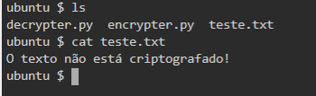
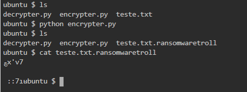
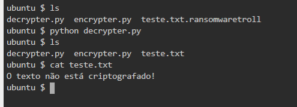

# Ransomware para criptografia de arquivos de texto em Python

### Recursos utilizados

- Python
- Biblioteca pyaes

### Procedimento

- Antes de rodar o arquivo encrypter.py certifique-se que a biblioteca pyaes está instalada: ``` pip install pyaes ```
- Após, rode o arquivo com o seguinte comando: ``` python encrypter.py ```
- O arquivo  _'teste.txt'_ será substituído por um arquivo renomeado _'teste.txt.ransomwaretroll'_ totalmente criptografado
- Para restaurar o arquivo original rode o comando ``` python decrypter.py ```


### Passo 1 – Texto Original



### Passo 2 – Processo de Criptografia



### Passo 3 – Processo de Restauração
